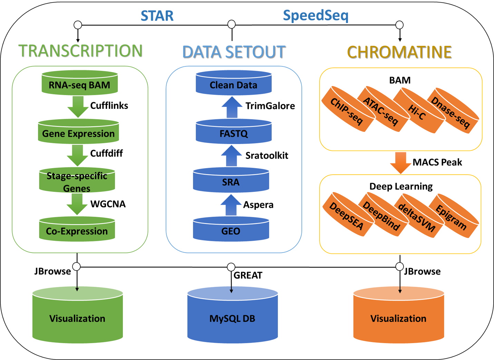
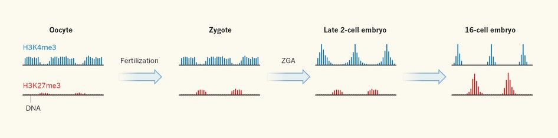
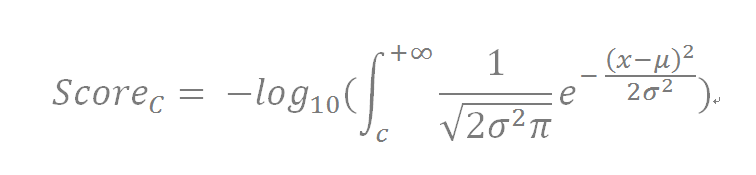
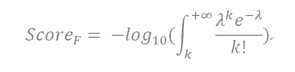

## EpiDenovo: a database of functional de novo mutations involved in embryonic epigenetic regulation

## What is EpiDenovo?
<dl>
<dd>
EpiDenovo is a database for annotation of the associations between embryonic epigenomes and DNMs in developmental disorders, including several neuropsychiatric disorders and congenital heart disease. EpiDenovo provides an easy-to-use web interface allowing users rapidly to find the epigenetic signatures of DNMs and the expression patterns of the genes that they regulate during embryonic development. In summary, EpiDenovo is a useful resource for selecting candidate genes for further functional studies in embryonic development of human and mouse, and for investigating DNMs causing or underlying developmental disorders of human.
</dd>
</dl>

## Data processing and data content of EpiDenovo
<dl>
<dd>
The information of embryonic epigenetic regulation was achieved from GEO (1). As shown in Figure 1, EpiDenovo hosts de novo mutations that potentially influence epigenetic regulation during embryonic development. EpiDenovo integrates embryonic epigenomes and transcriptomes to understand the mechanisms involved in the DNM regulatory elements orchestrating gene expression during embryonic development. In addition, EpiDenovo provided association of de novo mutations with developing diseases by retrieving denovo-db (2). The principal advantages of EpiDenovo, compared to other databases, for the annotation of functional variants are as follows: 
i.	It contains the most comprehensive collection of ChIP-seq, ATAC-seq, DNase-seq and Hi-C data with respect to the chromatin state during embryonic development for both humans and mice.
ii.	It has the potential to contribute to research, not only on embryonic development, but also on developmental diseases, as it provides the association of DNMs with the transcriptome and epigenome during embryonic development in human developmental disorders. 
iii.	It employs a statistical scoring system to annotate and prioritize the DNMs involved in epigenetic regulation during embryonic development. 
iv.	It provides an in-depth annotation of the genes of interest by performing weighted gene co-expression network analysis and functional enrichment analysis. 
v.	It provides motif enrichment in peaks of epigenetic factor for each experiment to predict the potential binding of transcription factors by similarity of binding motif. 
</dd>
</dl>

## 

## Data downloading and preparation
<dl>
<dd>
All raw data deposited in SRA format were downloaded from GEO using Aspera and converted into the FASTQ format using the fastq-dump of Sratoolkit from NCBI. Sequencing adapters and low quality sequences were trimmed using the Trim Galore program of Babraham Bioinformatics (https://www.bioinformatics.babraham.ac.uk/projects/trim_galore/), with default parameters.
</dd>
</dl>

## Reads mapping and coverage
<dl>
<dd>
All RNA-seq data were mapped to the mm10 genome for mouse, and hg38 genome for human, using STAR (v2.5.3a) (3,4), which was shown to be highly effective in mapping RNA-seq reads containing SNPs (5). Then, duplicated reads for pair-end data were removed, but not single-end data by SAMtools (v1.5) (6). All ChIP-seq, ATAC-seq and Dnase-seq (Mnase-seq or FAIRE-seq) data were mapped to the mm10 genome for mouse, and hg38 genome for humans, by using SpeedSeq (v0.1.2) (7), which is an open-source genome analysis platform that achieves alignment, variant detection and function with a low memory requirement. Then, we removed any duplicated reads for both pair-end and single-end data using SAMtools. For all sequencing datasets, the bigwig files for JBrowse visualization were generated from BAM files by using “bamCoverage” from deepTools (8) with parameters “--ignoreDuplicates --normalizeUsingRPKM --skipNonCoveredRegions --binSize 25 --ignoreForNormalization chrX chrM”. Samples with too low coverage (mapped data < 1M) were filtered.
</dd>
</dl>

## Peak calling and annotation
<dl>
<dd>
BAM files of mapping results were merged for the same sample using SAMtools and converted to BED format by using BEDTools (9). Peaks of regulatory regions were called for each sample by using MACS2 (10) from datasets of ChIP-seq, ATAC-seq and DNase-seq with parameters “-f BED -B -q 0.01 --fix-bimodal --extsize 147 --keep-dup auto”. In particular, the input signal was used as the control to call peaks for the ChIP-seq dataset which has a corresponding control (input) experiment (Table S7). Peak annotation was performed by using HOMER (11) with default parameters. Motif analysis on peak regions was performed with HOMER function findMotifsGenome.pl with parameters “-size 50 -mask”. In addition, 74,060,441 peaks regions were curated from GTRD (12) in order to expand the annotation of transcription binding sites from other tissues or cells.
</dd>
</dl>

## Hi-C data analysis
<dl>
<dd>
Paired-end raw reads of Hi-C libraries were aligned, processed and corrected iteratively using HiCPro (v2.8.1) (13). Briefly, sequencing reads were first independently aligned to the mouse reference genome (mm10) using the bowtie2 end-to-end algorithm and the ‘-very-sensitive’ option. To rescue the chimaeric fragments spanning the ligation junction, the ligation site was detected and the 5' fraction of the reads was aligned back to the reference genome. Unmapped reads, multiple mapped reads and singletons were then discarded. Pairs of aligned reads were then assigned to enzyme restriction fragments. Read pairs from uncut DNA, self-circle ligations and PCR artefacts were filtered out, and valid read pairs involving two different restriction fragments were used to build a contact matrix. Valid read pairs were then binned at a specific resolution by dividing the genome into bins of equal size. A 40-kb or 200-kb bin size was chosen for the examination of the global interaction patterns of the genome. The binned interaction matrices were then normalized using the iterative correction method (13,14) to correct for biases such as the GC content, mappability and effective fragment length in Hi-C data. In addition, we also curated 3,095,881 chromatin contact pairs from the 4DGeneome (15) in order to expand the annotation of chromatin interactions from other tissues or cells.
</dd>
</dl>

## Gene expression and stage-specific genes
<dl>
<dd>
BAM files of RNA-seq data were merged for the same sample using SAMtools (6), and transcript reconstruction was performed by StringTie (version v1.3.3b) (16), based on the GTF gene annotation of Ensembl GRCh38 (release 89). Chimeric reads, multi-overlapping reads and low-quality reads (MAPQ < 10) were excluded when a fragment count for each gene was extracted by using featureCounts (17) from Subread package (18) with parameters “--primary –Q 10 –p -C -F GTF -T 16 -s 0”. The FPKM value of gene expression was also determined by perl script. A one-way analysis of variance like (ANOVA-like) test was applied in order to screen for genes that were differentially expressed among all groups by using edgeR (19,20) with the function “glmFit” and “glmLRT”.
</dd>
</dl>

## 

## Gene co-expression and function enrichment analysis

<dl>
<dd>
Co-expression analysis represents a powerful tool for the identification of genes involved in the same molecular process. Because genes that participate in the same molecular process are often expressed in similar ways across different stages of development, we can use the expression profiles of genes with known functions in order to identify other genes with related functions. To understand the co-expression relationships between genes at a transcriptome-wide level, weighted gene co-expression network analysis (WGCNA) (21) was performed, as this is capable of determining the activity and importance of each module in each subpopulation of samples (22). Proper soft-thresholding power was determined by performing an analysis of the network topology before construction of the network. Then, one-step network construction workflow with a soft-thresholding power value of 6 for human and 8 for mouse, respectively, was employed. Genes with null expression < 98% in all samples (n= 51,247 for humans; n= 45,008 for mice) were selected to perform WGCNA analysis; a kME > 0.3 was assigned to an eigengene module. Co-expression networks can subsequently be interpreted by functional enrichment analysis, which is a method for identifying and ranking overrepresented functional categories in a list of genes (22). So these co-expression genes in certain networks were selected to perform function enrichment analysis, including Gene Ontology and the KEGG pathway by using R package clusterProfiler (23).
</dd>
</dl>

## Scoring system to identify functional DNMs

<dl>
<dd>
Each mutation was scored, based on its annotated records in five functional categories: conservation score, histone modification state, transcription factor binding sites, chromatin interacting regions and chromatin accessible regions. In contrast to the scoring scheme of EpiDenovo (24), which classified variants into classes with a heuristic scoring system, EpiDenovo employed a quantitative scoring system to evaluate the functional significance of a DNM in different categories. For the conservation category (C), we used PhyloP scores in 100 vertebrate genomes to assign conservation scores to DNMs. PhyloP scores of all DNMs in a chromosome followed a Gaussian distribution. Considering that a DNM has a conservation score of c, μ and σ, as these are the fitted parameters of the corresponding Gaussian model, then the score of the DNM in the conservation category is defined as follows:
</dd>
</dl>

## 

## 

<dl>
<dd>
For the other four regulatory categories, we used the number of annotated hits (records) to assign a score to a DNM in the corresponding category. Specifically, the numbers of hits of all DNMs in each chromosome were fitted to a Poisson distribution model. Taking a DNM to have k hits in one functional category (F), λ is the fitted parameter of the corresponding Poisson model, and the score of the DNM in this category is defined as follows:
</dd>
</dl>

## 

## 

<dl>
<dd>
The total score of a DNM is the sum of scores of the five functional categories. The calculation of the scoring system was implemented by R and Perl (3).
</dd>
</dl>

## For more you want to explore 

(http://61.148.58.210:8080/EpiDenovo/jbrowse.php)

## References
<dl>

###### 1.	Barrett, T., Wilhite, S.E., Ledoux, P., Evangelista, C., Kim, I.F., Tomashevsky, M., Marshall, K.A., Phillippy, K.H., Sherman, P.M., Holko, M. et al. (2013) NCBI GEO: archive for functional genomics data sets-update. Nucleic Acids Res, 41, D991-D995.

###### 2.	Turner, T.N., Yi, Q., Krumm, N., Huddleston, J., Hoekzema, K., HA, F.S., Doebley, A.L., Bernier, R.A., Nickerson, D.A. and Eichler, E.E. (2017) denovo-db: a compendium of human de novo variants. Nucleic Acids Res, 45, D804-D811.

###### 3.	Dobin, A., Davis, C.A., Schlesinger, F., Drenkow, J., Zaleski, C., Jha, S., Batut, P., Chaisson, M. and Gingeras, T.R. (2013) STAR: ultrafast universal RNA-seq aligner. Bioinformatics, 29, 15-21.

###### 4.	Krzywinski, M., Schein, J., Birol, I., Connors, J., Gascoyne, R., Horsman, D., Jones, S.J. and Marra, M.A. (2009) Circos: An information aesthetic for comparative genomics. Genome Res, 19, 1639-1645.

###### 5.	Wu, J., Huang, B., Chen, H., Yin, Q., Liu, Y., Xiang, Y., Zhang, B., Liu, B., Wang, Q., Xia, W. et al. (2016) The landscape of accessible chromatin in mammalian preimplantation embryos. Nature, 534, 652-657.

###### 6.	Li, H., Handsaker, B., Wysoker, A., Fennell, T., Ruan, J., Homer, N., Marth, G., Abecasis, G., Durbin, R. and Proc, G.P.D. (2009) The Sequence Alignment/Map format and SAMtools. Bioinformatics, 25, 2078-2079.

###### 7.	Chiang, C., Layer, R.M., Faust, G.G., Lindberg, M.R., Rose, D.B., Garrison, E.P., Marth, G.T., Quinlan, A.R. and Hall, I.M. (2015) SpeedSeq: ultra-fast personal genome analysis and interpretation. Nature Methods, 12, 966-968.

###### 8.	Ramirez, F., Dundar, F., Diehl, S., Gruning, B.A. and Manke, T. (2014) deepTools: a flexible platform for exploring deep-sequencing data. Nucleic Acids Res, 42, W187-W191.

###### 9.	Quinlan, A.R. and Hall, I.M. (2010) BEDTools: a flexible suite of utilities for comparing genomic features. Bioinformatics, 26, 841-842.

###### 10.	Feng, J.X., Liu, T., Qin, B., Zhang, Y. and Liu, X.S. (2012) Identifying ChIP-seq enrichment using MACS. Nat Protoc, 7, 1728-1740.

###### 11.	Heinz, S., Benner, C., Spann, N., Bertolino, E., Lin, Y.C., Laslo, P., Cheng, J.X., Murre, C., Singh, H. and Glass, C.K. (2010) Simple Combinations of Lineage-Determining Transcription Factors Prime cis-Regulatory Elements Required for Macrophage and B Cell Identities. Mol Cell, 38, 576-589.

###### 12.	Yevshin, I., Sharipov, R., Valeev, T., Kel, A. and Kolpakov, F. (2017) GTRD: a database of transcription factor binding sites identified by ChIP-seq experiments. Nucleic Acids Res, 45, D61-D67.

###### 13.	Servant, N., Varoquaux, N., Lajoie, B.R., Viara, E., Chen, C.J., Vert, J.P., Heard, E., Dekker, J. and Barillot, E. (2015) HiC-Pro: an optimized and flexible pipeline for Hi-C data processing. Genome Biol, 16.

###### 14.	Imakaev, M., Fudenberg, G., McCord, R.P., Naumova, N., Goloborodko, A., Lajoie, B.R., Dekker, J. and Mirny, L.A. (2012) Iterative correction of Hi-C data reveals hallmarks of chromosome organization. Nat Methods, 9, 999-1003.

###### 15.	Teng, L., He, B., Wang, J.H. and Tan, K. (2015) 4DGenome: a comprehensive database of chromatin interactions. Bioinformatics, 31, 2560-2564.

###### 16.	Pertea, M., Pertea, G.M., Antonescu, C.M., Chang, T.C., Mendell, J.T. and Salzberg, S.L. (2015) StringTie enables improved reconstruction of a transcriptome from RNA-seq reads. Nature Biotechnology, 33, 290-+.

###### 17.	Liao, Y., Smyth, G.K. and Shi, W. (2014) featureCounts: an efficient general purpose program for assigning sequence reads to genomic features. Bioinformatics, 30, 923-930.

###### 18.	Liao, Y., Smyth, G.K. and Shi, W. (2013) The Subread aligner: fast, accurate and scalable read mapping by seed-and-vote. Nucleic Acids Res, 41, e108.

###### 19.	Robinson, M.D., McCarthy, D.J. and Smyth, G.K. (2010) edgeR: a Bioconductor package for differential expression analysis of digital gene expression data. Bioinformatics, 26, 139-140.

###### 20.	McCarthy, D.J., Chen, Y. and Smyth, G.K. (2012) Differential expression analysis of multifactor RNA-Seq experiments with respect to biological variation. Nucleic Acids Res, 40, 4288-4297.

###### 21.	Langfelder, P. and Horvath, S. (2008) WGCNA: an R package for weighted correlation network analysis. Bmc Bioinformatics, 9.

###### 22.	van Dam, S., Vosa, U., van der Graaf, A., Franke, L. and de Magalhaes, J.P. (2017) Gene co-expression analysis for functional classification and gene-disease predictions. Brief Bioinform.

###### 23.	Yu, G., Wang, L.G., Han, Y. and He, Q.Y. (2012) clusterProfiler: an R package for comparing biological themes among gene clusters. OMICS, 16, 284-287.

###### 24.	Mao, F., Xiao, L., Li, X., Liang, J., Teng, H., Cai, W. and Sun, Z.S. (2016) RBP-Var: a database of functional variants involved in regulation mediated by RNA-binding proteins. Nucleic Acids Res, 44, D154-163.

###### 25.	Langmead, B. and Salzberg, S.L. (2012) Fast gapped-read alignment with Bowtie 2. Nature Methods, 9, 357-U354.

###### 26.	Buels, R., Yao, E., Diesh, C.M., Hayes, R.D., Munoz-Torres, M., Helt, G., Goodstein, D.M., Elsik, C.G., Lewis, S.E., Stein, L. et al. (2016) JBrowse: a dynamic web platform for genome visualization and analysis. Genome Biol, 17.

</dl>
